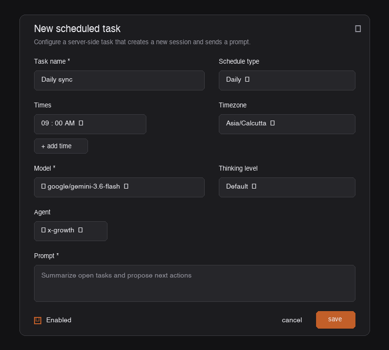

# PITCH (x_bot)

A native Rust engine and OpenCode agent that runs X/Twitter mentions, AI video demo generation, and founder outreach for [PITCH](https://trypitch.co).

PITCH turns written walkthroughs into 1080p narrated product demos. This repo handles the X side: receiving mention webhooks, generating demo videos via Pitch MCP, posting video replies, discovering SaaS prospects, and tracking pipeline state in a local SQLite database.

## Architecture

Everything runs locally via a single compiled Rust binary (`pitch-cli`) and a local SQLite database (`data/pitch_bot.db`). No external servers, no cloud middleware, and no polling daemons.

```
                     Incoming Mention Webhook / Trigger
                                    │
                                    ▼
                           Rust Webhook Server
                      (pitch-cli server - Port 8790)
                                    │
                     Dispatches OpenCode Agent Pass
                                    │
                                    ▼
                          OpenCode Agent (x-growth)
                            pitch-cli Toolset
                                    │
                                    ▼
                            SQLite Database
                          (data/pitch_bot.db)
```

The system splits into two distinct operational paths:

1. **Real-time webhook pipeline (Zero cron):** An embedded Rust Axum server listens on port `8790`. When X sends a mention webhook (`POST /api/webhook/x`), the server immediately posts a receipt reply on X, triggers Pitch MCP video generation, and delivers the final video link when rendering completes.
2. **Scheduled growth passes:** Outbound prospect discovery, warm-up engagement, and founder commentary run as short, focused OpenCode agent passes.

## Webhook API Endpoints (`/api/webhook/`)

The embedded Rust server listens on `http://0.0.0.0:8790` and exposes the following endpoints:

| Method | Endpoint | Purpose | Example |
|---|---|---|---|
| **`GET`** | `/api/webhook/x` | **X CRC Challenge Check** (Account Activity API registration) | `curl "http://localhost:8790/api/webhook/x?crc_token=test"` |
| **`POST`** | `/api/webhook/x` | **X Real-Time Mention Callback** | Triggered by X on new `@trypitchdotco` mention |
| **`POST`** | `/api/webhook/trigger` | **Manual Webhook Trigger** | `curl -X POST http://localhost:8790/api/webhook/trigger -H "Content-Type: application/json" -d '{"action":"mentions"}'` |
| **`GET`** | `/api/webhook/health` | **Health Check** & uptime | `curl http://localhost:8790/api/webhook/health` |
| **`GET`** | `/api/webhook/stats` | **Pipeline Stats** & SQLite DB summary | `curl http://localhost:8790/api/webhook/stats` |

### Trigger Endpoint Examples (`POST /api/webhook/trigger`)

Trigger an inbox mention pass:
```bash
curl -X POST http://localhost:8790/api/webhook/trigger \
  -H "Content-Type: application/json" \
  -d '{"action": "mentions"}'
```

Trigger an outbound prospect discovery pass:
```bash
curl -X POST http://localhost:8790/api/webhook/trigger \
  -H "Content-Type: application/json" \
  -d '{"action": "growth"}'
```

## Open Chamber Scheduler

For scheduled tasks, use [Open Chamber](https://openchamber.ai)'s server-side task scheduler to trigger OpenCode agent passes without keeping a session open continuously.



### Recommended Scheduled Tasks

| Task Name | Schedule | Timezone | Agent | Prompt |
|---|---|---|---|---|
| **Prospect Discovery** | Every 3 Hours | `Asia/Calcutta` | `x-growth` | `Discover new SaaS founder prospects and score them into SQLite` |
| **Warm Prospect Engagement** | Daily at 09:00, 14:00, 19:00 | `Asia/Calcutta` | `x-growth` | `Engage warm prospects with likes and personalized replies` |
| **Founder Commentary** | Daily at 11:00 AM | `Asia/Calcutta` | `x-growth` | `Scan trends and publish one founder commentary tweet` |
| **Pipeline Sync** | Daily at 09:00 AM | `Asia/Calcutta` | `x-growth` | `Run pipeline sync and summarize database stats` |

## Setup

### 1. Requirements

- Rust 1.80+ (`cargo` / `rustc`)
- OpenCode CLI

### 2. Configuration

Copy `.env.example` to `.env` and fill in your keys:

```bash
cp .env.example .env
```

Required variables:

```env
X_USER_ACCESS_TOKEN=your_oauth2_user_access_token
X_USER_REFRESH_TOKEN=your_oauth2_user_refresh_token
X_CLIENT_ID=your_x_client_id
X_CLIENT_SECRET=your_x_client_secret
PITCH_API_KEY=pk_tltxrmrZgiprXR51z_dJvoIF0yWiGBVB
PORT=8790
SQLITE_DB_PATH=./data/pitch_bot.db
```

### 3. Build

```bash
cargo build --release
```

The compiled binary is saved at `./target/release/pitch-cli`.

## CLI Commands

### Webhook Server

```bash
./target/release/pitch-cli server
```

### Pipeline Triggers

```bash
./target/release/pitch-cli inbox       # Ingest mentions and trigger Pitch MCP jobs
./target/release/pitch-cli worker      # Poll Pitch MCP and deliver completed video demos
./target/release/pitch-cli trigger     # Run combined inbox + worker pass
./target/release/pitch-cli discover    # Search X for ICP prospects and score leads
./target/release/pitch-cli sync        # Print pipeline summary
```

### Database Memory

```bash
./target/release/pitch-cli db jobs                # List mention jobs
./target/release/pitch-cli db jobs --status rendering  # List active rendering jobs
./target/release/pitch-cli db prospects           # List CRM prospects
./target/release/pitch-cli db insights            # Read adaptive memory insights
```

### X API v2

```bash
./target/release/pitch-cli x-api me               # Check authenticated account
./target/release/pitch-cli x-api mentions         # Fetch recent mentions
./target/release/pitch-cli x-api reply <id> --text "..."  # Post reply
./target/release/pitch-cli x-api post --text "..." # Post tweet
./target/release/pitch-cli x-api search "query"   # Search X
```

### Safety & Budget Enforcers

```bash
./target/release/pitch-cli circuit-breaker        # Check circuit breaker status
./target/release/pitch-cli circuit-breaker --reset # Reset circuit breaker
./target/release/pitch-cli budget                 # Check daily action caps and burst limit
```
